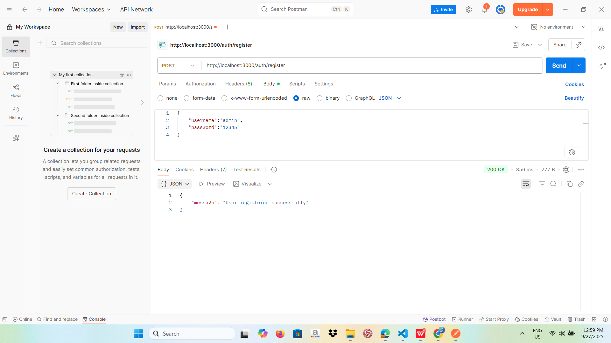
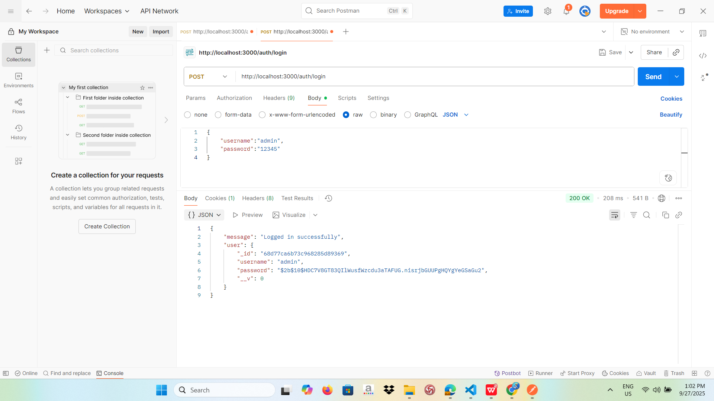

# Local Passport Auth Service

Ứng dụng xác thực người dùng với **Passport Local** và lưu session bằng MongoDB.

## Cài đặt

```bash
git clone https://github.com/lehuynhnhu-git/local_passport_auth_service.git
cd local_passport_auth_service
npm install
node app.js

1. Register
## Demo kết quả

2. Login
## Demo kết quả

